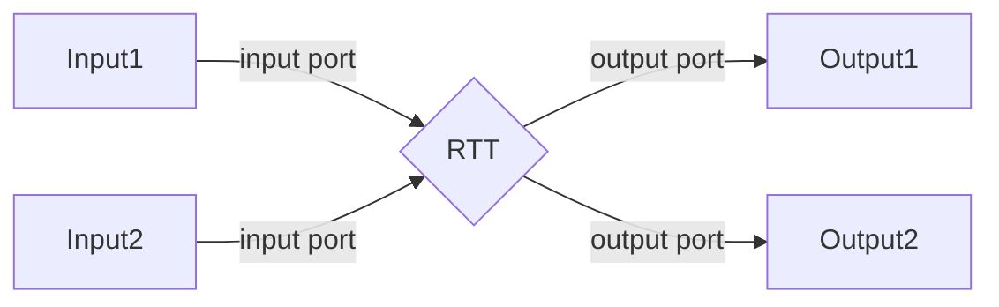

<h1 align="center"> SYSTEM PROGRAMMING WEEK 09 </h1>
<h2 align="center"> Orocos Real-time Toolkit </h2>
<h5 align="right"> -- by Jeremy Zhang @ Johns Hopkins University</h5>

[TOC]


# I. Orocos Real-Time Toolkit (RTT)

Installation instruction:

in your workspace folder:

```bash
git clone --recursive https://github.com/orocos-toolchain/orocos_toolchain.git src/orocos/orocos_toolchain
git clone https://github.com/orocos/rtt_ros_integration.git src/rtt_ros_integration
git clone https://github.com/orocos/rtt_geometry.git src/rtt_geometry

rosdep install --from-paths src --ignore-src -y

catkin build rtt_ros_integration rtt_geometry orocos_toolchain 

```

It will take a lot of time to build. Don't worry.


## 1.1 Introduction to RTT

real time toolkit is super handy thing when you are dealing with controlling the hardware.

KDL is for kinematics problems.

[https://www.orocos.org/stable/documentation/rtt/v2.6.x/api/html/index.html](https://www.orocos.org/stable/documentation/rtt/v2.6.x/api/html/index.html)

[GITHUB Mainpage](https://github.com/orocos-toolchain/orocos_toolchain)

github contains a readme that guides you to install 

The base virtual class for RTT is TaskContext.

In the TaskContext most important methods are the hooks



Which indicates that we need port to get access to the RTT

Orocos is a different creature other than ros. Like Gazebo, you need to obey its own rules and manage to connect what you write based on orocos and ros itself.


## 1.2 Introduction to Deployer

- **deployer** is a bash where you can change a lot of things through command line

```bash
# in terminal type
$ /opt/ros/melodic/bin/deployer
# will start it and you can try something inside
# you can use cd to jump between different control loops 

# or you can start it through rosrun
$ rosrun rtt_ros deployer
# and you will see something look exactly the same as a terminal inside the original terminal
Real-time memory: 517888 bytes free of 524288 allocated.
   Switched to : Deployer

  This console reader allows you to browse and manipulate TaskContexts.
  You can type in an operation, expression, create or change variables.
  (type 'help' for instructions and 'ls' for context info)

    TAB completion and HISTORY is available ('bash' like)

    Use 'Ctrl-D' or type 'quit' to exit this program.

Deployer [S]> 

```

you can import packages like people usually do in python:

```bash
$ Deployer [S]> import("rtt_ros")
 = true        
```


Deployer is much like a shell, you can type in some scripts or bash command on it.

You can find all supported data types:

```bash
$ Deployer [S]> .types
Available data types:  BufferPolicy ConnPolicy FlowStatus PropertyBag SendHandle SendStatus TaskContext WriteStatus array bool cfloat32[] cfloat64[] char cint16[] cint32[] cint64[] cint8[] cstring[] cuint16[] cuint32[] cuint64[] cuint8[] double duration float float32 float32[] float64 float64[] int int16 int16[] int32 int32[] int64 int64[] int8 int8[] ints llong rt_string string string[] strings time uint uint16 uint16[] uint32 uint32[] uint64 uint64[] uint8 uint8[] ullong void
```

You can also import some ros supported types ( which are contained in some lib files )

```bash
$ Deployer [S]> import("rtt_geometry_msgs")
 = true                

Deployer [S]> .types

Available data types:  geometry_msgs.Accel geometry_msgs.AccelStamped geometry_msgs.AccelStamped[] geometry_msgs.AccelWithCovariance geometry_msgs.AccelWithCovarianceStamped geometry_msgs.AccelWithCovarianceStamped[] geometry_msgs.AccelWithCovariance[] geometry_msgs.Accel[] geometry_msgs.Inertia geometry_msgs.InertiaStamped geometry_msgs.InertiaStamped[] geometry_msgs.Inertia[] geometry_msgs.Point geometry_msgs.Point32 geometry_msgs.Point32[] geometry_msgs.PointStamped geometry_msgs.PointStamped[] geometry_msgs.Point[] geometry_msgs.Polygon geometry_msgs.PolygonStamped geometry_msgs.PolygonStamped[] geometry_msgs.Polygon[] geometry_msgs.Pose geometry_msgs.Pose2D geometry_msgs.Pose2D[] geometry_msgs.PoseArray geometry_msgs.PoseArray[] geometry_msgs.PoseStamped geometry_msgs.PoseStamped[] geometry_msgs.PoseWithCovariance geometry_msgs.PoseWithCovarianceStamped geometry_msgs.PoseWithCovarianceStamped[] geometry_msgs.PoseWithCovariance[] geometry_msgs.Pose[]
.
.
.
```

Much more types are loaded here. 

You can specify a new variable with given type

```bash
$ Deployer [S]> var geometry_msgs.Vector3 v
 = {x = 0, y = 0, z = 0 }

Deployer [S]> v.x = 0
 = 0                   

Deployer [S]> v.y = 10
 = 10                  

Deployer [S]> v
 = {x = 0, y = 10, z = 0 }
```


For sure, you can import other orocos type:

```bash
$ Deployer [S]> import("kdl_typekit")
 = true                

Deployer [S]> var KDL.Frame H
 = [                   [1           ,0           ,0           ;
 0           ,1           ,0           ;
 0           ,0           ,1           ]
[0           ,0           ,0           ]]

Deployer [S]> H.p[2]=99
 = 99                  

Deployer [S]> H
 = [                   
 [1           ,0           ,0           ;
 0           ,1           ,0           ;
 0           ,0           ,1           ]
[0           ,0           ,99          ]]
Deployer [S]> 
# They can be used in a very similar way you did when you call KDL class in cpp
```


# II. rrt_rsp package (C++)

```bash
$ catkin_create_pkg rtt_rsp kdl_parser roscpp rtt_geometry_msgs rtt_rosparam rtt_sensor_msgs rtt_ros rtt_rosnode rtt_rosparam
```

you can see that geometry_msgs with a prefix rtt, this means that you need geometry_msgs and you need them to be "understand" by rtt.


## 2.1 Briefly introduction to RTT abstract class

The [TaskContext](https://www.orocos.org/stable/documentation/rtt/v2.x/api/html/classRTT_1_1TaskContext.html) is the C++ representation of an [Orocos](https://www.orocos.org/stable/documentation/rtt/v2.x/api/html/namespaceOrocos.html) component.   [More...](https://www.orocos.org/stable/documentation/rtt/v2.x/api/html/classRTT_1_1TaskContext.html#details)

```
#include <rtt/TaskContext.hpp>
```

Inheritance diagram for RTT::TaskContext:

       

[List of all members.](https://www.orocos.org/stable/documentation/rtt/v2.x/api/html/classRTT_1_1TaskContext-members.html)


In the Protected Member Functions, we have several Hooks, let's take a look at them:

| Protected Member Functions |                                                              |
| -------------------------- | ------------------------------------------------------------ |
| void                       | [forceActivity](https://www.orocos.org/stable/documentation/rtt/v2.x/api/html/classRTT_1_1TaskContext.html#a59ef45d1d0a48a1123763ed534a9b4b2) ([base::ActivityInterface](https://www.orocos.org/stable/documentation/rtt/v2.x/api/html/classRTT_1_1base_1_1ActivityInterface.html) *new_act) |
|                            | Forces the current activity to become *new_act*, even if this [TaskContext](https://www.orocos.org/stable/documentation/rtt/v2.x/api/html/classRTT_1_1TaskContext.html) is still running. |
| virtual bool               | [configureHook](https://www.orocos.org/stable/documentation/rtt/v2.x/api/html/classRTT_1_1base_1_1TaskCore.html#a9badff843c97307d2b3084c4320606c6) () |
|                            | Implement this method such that it contains the code which will be executed when *[configure()](https://www.orocos.org/stable/documentation/rtt/v2.x/api/html/classRTT_1_1base_1_1TaskCore.html#a492aed947a9bb2cbc25140884bc34e1b)* is called.  Method to find things like ur_description topic and get the info through it. |
| virtual void               | [cleanupHook](https://www.orocos.org/stable/documentation/rtt/v2.x/api/html/classRTT_1_1base_1_1TaskCore.html#a7079becea7aa4945ba69cc202713592c) () |
|                            | Implement this method such that it contains the code which will be executed when *[cleanup()](https://www.orocos.org/stable/documentation/rtt/v2.x/api/html/classRTT_1_1base_1_1TaskCore.html#a009c3d9b097d1904ca6eac98a5b48d0c)* is called. |
| virtual bool               | [startHook](https://www.orocos.org/stable/documentation/rtt/v2.x/api/html/classRTT_1_1base_1_1TaskCore.html#add908fc9e1fcb95dea895e6231edf075) () |
|                            | Implement this method such that it contains the code which will be executed when *[start()](https://www.orocos.org/stable/documentation/rtt/v2.x/api/html/classRTT_1_1base_1_1TaskCore.html#a975fddfc6d0fd5dfa77303c20395d87c)* is called. |
| virtual void               | [updateHook](https://www.orocos.org/stable/documentation/rtt/v2.x/api/html/classRTT_1_1base_1_1TaskCore.html#a4b16151ed99062bca250ddfe667a3604) () |
|                            | Function where the user must insert his 'application' code.   **Most important** |
| virtual bool               | [breakUpdateHook](https://www.orocos.org/stable/documentation/rtt/v2.x/api/html/classRTT_1_1base_1_1TaskCore.html#ad4a3f8cbcfee40c1bc1f4394dadfcf82) () |
|                            | Implement this function if your code might block for long times inside the [updateHook()](https://www.orocos.org/stable/documentation/rtt/v2.x/api/html/classRTT_1_1base_1_1TaskCore.html#a4b16151ed99062bca250ddfe667a3604) function. |
| virtual void               | [errorHook](https://www.orocos.org/stable/documentation/rtt/v2.x/api/html/classRTT_1_1base_1_1TaskCore.html#a1d100268cdda1f60af1e2203d155168b) () |
|                            | Implement this method to contain code that must be executed in the RunTimeError state, instead of [updateHook()](https://www.orocos.org/stable/documentation/rtt/v2.x/api/html/classRTT_1_1base_1_1TaskCore.html#a4b16151ed99062bca250ddfe667a3604). |
| virtual void               | [exceptionHook](https://www.orocos.org/stable/documentation/rtt/v2.x/api/html/classRTT_1_1base_1_1TaskCore.html#a576b146a57bd81b1f5fe3a8e51f0bd16) () |
|                            | Implement this method to contain code that must be executed when transitioning to the Exception state. |
| virtual void               | [stopHook](https://www.orocos.org/stable/documentation/rtt/v2.x/api/html/classRTT_1_1base_1_1TaskCore.html#a8bfeb7f3c3d066080d5af36baacb6648) () |
|                            | Implement this method such that it contains the code which will be executed when *[stop()](https://www.orocos.org/stable/documentation/rtt/v2.x/api/html/classRTT_1_1base_1_1TaskCore.html#aa69a1db58d9b3695477ac75866e4e62c)* is called. |
| virtual void               | [fatal](https://www.orocos.org/stable/documentation/rtt/v2.x/api/html/classRTT_1_1base_1_1TaskCore.html#af208a7b9442ba87f42a3a52a28c5309f) () |
|                            | Call this method from any place to indicate that this component encountered a fatal error. |
| virtual void               | [exception](https://www.orocos.org/stable/documentation/rtt/v2.x/api/html/classRTT_1_1base_1_1TaskCore.html#a243f1797bcfef248146ee02166a1eeb8) () |
|                            | Call this method to indicate a run-time exception happend.   |

**Most of the time we put the most important thing in the updateHook();**


## 2.2 rtt_sensor.hpp

```cpp
#include <ros/ros.h>
#include <geometry_msgs/WrenchStamped.h>
#include <rtt/TaskContext.hpp>
#include <rtt/OutputPort.hpp>

class rtt_sensor : public RTT::TaskContext {

private:
    RTT:OutputPort<geometry_msgs::WrenchStamped> port_msr_wrench; // msr is short for measurement

public:

    rtt_sensor( const std::string& name);
    ~rtt_sensor();

    virtual bool configureHook();
    virtual bool startHook();

    virtual void updateHook();

    virtual void stopHook();
    virtual void cleanupHook();

};
```


## 2.3 rtt_sensor.cpp

```cpp
#include <rtt_rsp/rtt_sensor.hpp>
#include <rtt/Component.hpp>

rtt_sensor::rtt_sensor( const std::string& name):
    RTT::TaskContext( name ),
    port_msr_wrench("Measured wrench"){ // you can initialize this member variable when the class is called the port_msr_wrench is named as "Measured wrench"

    addPort("MsrWrench", port_msr_wrench);

    std::cout<<"rtt_sensor::rtt_sensor"<< std::endl;

}

rtt_sensor::~rtt_sensor(){}

bool rtt_sensor::configureHook(){}
bool rtt_sensor::startHook(){}
void rtt_sensor::updateHook(){}
void rtt_sensor::stopHook(){}
void rtt_sensor::cleanupHook(){} // these five hooks are necessary in rtt

ORO_CREATE_COMPONENT(rtt_sensor) // we won't have a node ( main function in other words) so we need to make it like a plugin
```

> Briefly explain these five hooks;
>
> configure hook: is called when you type in "configure" command
>
> start hook: when you initiate a thread, a start hook will be called along with the thread, in other words, the start hook is called inside a thread.
>
> update hook: is the one that run repetitively during the thread is running.


## 2.4 CmakeList.txt

in the cmake list, we need to add orocos stuff like this :

```cmake
include_directories(
  include
  ${catkin_INCLUDE_DIRS}
)

orocos_component( rtt_sensor src/rtt_sensor.cpp ) # remember to add this every time you need a orocos code snippet
# this library will be built and put in /rsp_workspace/devel/lib/orocos/gnulinux/rtt_rsp directory. The file is named as librtt_sensor-gnulinux.so

target_link_libraries( rtt_sensor 
  ${catkin_LIBRARIES}
) # we need to put our class a library
 
```

then catkin build rtt_rsp to build this package.


# III. Deployer

**we have to run a roscore first**

## 3.1 Import

After you build your rtt_rsp lib, you can rosrun deployer node and import some libs

```bash
$ Deployer [S]> import("rtt_ros")
 = true                

$ Deployer [S]> import("rtt_geometry_msgs")
 = true                

$ Deployer [S]> import("rtt_rsp")
 = true                

$ Deployer [S]> import("kdl_typekit")
 = true          
```

- in deployer, **ls** will tell you all the available commands

we want to load our component here, so we first look up to load component function

```bash
$ Deployer [S]> help loadComponent

 loadComponent( string const& Name, string const& Type ) : bool
   Load a new component instance from a library.
   Name : The name of the to be created component
   Type : The component type, used to lookup the library.

# So we follow the rules to load components
$ Deployer [S]> loadComponent("sensor","rtt_sensor") # "sensor" is the name and "rtt_sensor" is the type, it is the name of the class that we defined in our rtt_rsp package
rtt_sensor::rtt_sensor
rtt sensor created successfully # these two lines of output is what we have in our rtt_sensor.cpp addPort()
 = true                


# Now you typein ls, you will see a peer appear
$ Deployer [S]> ls

 Listing TaskContext Deployer[S] :

 Configuration Properties: 
     ...

 Provided Interface:
  Attributes   :          
	   ...

  Operations      : ...

 Data Flow Ports: (none)

 Services: 
(none)

 Requires Operations :  (none)
 Requests Services   :  (none)

 Peers        : sensor[S] # here we have a peer whose name is sensor
```


to check the imported types:

```bash
$ Deployer [S]> .types
Available data types:  geometry_msgs.Accel geometry_msgs.AccelStamped geometry_msgs.AccelStamped[] geometry_msgs.AccelWithCovariance geometry_msgs.AccelWithCovarianceStamped geometry_msgs.AccelWithCovarianceStamped[] geometry_msgs.AccelWithCovariance[] geometry_msgs.Accel[] geometry_msgs.Inertia geometry_msgs.InertiaStamped geometry_msgs.InertiaStamped[] ...
```


## 3.2 cd command

In deployer, everything is pretty much look like a terminal, so you can do cd command to check what's in the "sensor"

```bash
$ Deployer [S]> cd sensor 

TaskBrowser connects to all data ports of sensor
   Switched to : sensor
$ sensor [S]> ls # now you see that the name on the left has been changed to sensor instead of deployer
# in below what you find is the available operations for sensor

 Listing TaskContext sensor[S] :

 Configuration Propert    <node pkg="controller_manager" type="controller_manager" name="joint_state_controller_spawner" 
    args="spawn joint_state_controller" output="screen"/>ies: (none)

 Provided Interface:
  Attributes   : 
       bool TriggerOnStart = true                
       uint CycleCounter   = 1                   
       uint IOCounter      = 0                   
       uint TimeOutCounter = 0                   
       uint TriggerCounter = 1                   

  Operations      : activate cleanup configure error getCpuAffinity getPeriod inException inFatalError inRunTimeError isActive isConfigured isRunning loadService setCpuAffinity setPeriod start stop trigger update 

 Data Flow Ports: 
 Out(C) geometry_msgs.WrenchStamped MsrWrench      => (/geometry_msgs/WrenchStamped)

 Services: 
  MsrWrench      ( No description set for this Port. Use .doc() to document it. ) # MsrWrench is the name we have for our ourput port

 Requires Operations :  (none)
 Requests Services   :  (none)

 Peers        : (none)
```


## 3.3 setActivity

```bash
$ Deployer [S]> help setActivity

 setActivity( string const& CompName, double Period, int Priority, int SchedType ) : bool
   Attach an activity to a Component.
   CompName : The name of the Component.
   Period : The period of the activity (set to 0.0 for non periodic).
   Priority : The priority of the activity. # You can even put it in a priority ahead of operating system. But be careful, that will be unstoppable because you cannot even control it through your OS. Your cpu will be burnt.
   SchedType : The scheduler type of the activity.
```

Let's setActivity for rtt_rsp

```bash
$ Deployer [S]> setActivity( "sensor", 0.01, 0, ORO_SCHED_OTHER)
```

Now you can use the hooks that we defined in our cpp just like this:

```bash
Deployer [S]> sensor.configure 
 = true                

Deployer [S]> sensor.start 
 = true
 # Note: there is no "Hook" word here
```


You can also set the frequency in the runtime:

```bash
Deployer [S]> cd sensor
sensor [R]> setPeriod(0.1) # Now you set the frequency from 100 Hz to 10 Hz, by default, you give it a 0.01 period
```


## 3.4 Scripts file for Deployer

like the bashrc scripts, we have .ops file for deployer

So create a file called sensor.ops in src/rtt_rsp/scripts/sensor.ops

**sensor.ops**:

```ops
import("rtt_ros")
import("rtt_rosnode")
import("rtt_roscomm")
import("rtt_geometry_msgs")
import("rtt_sensor_msgs")
import("kdl_typekit")
import("rtt_rsp")

loadComponent("sensor", "rtt_sensor")
setActivity("sensor", 0.01, 0, ORO_SCHED_OTHER )

sensor.configure()
sensor.start()
```

then you can run the rtt_ros node by loading these script

```bash
$ rosrun rtt_ros deployer -s src/rtt_rsp/scripts/sensor.ops # through -s option you can load scripts by inputs its directory
```

You'll see the following result

```bash
rtt_sensor::rtt_sensor # these words are set in our hook functions
rtt sensor created successfully # these words are set in our hook functions
configure hook created successfully # these words are set in our hook functions
start hook created successfully # these words are set in our hook functions
   Switched to : Deployer

  This console reader allows you to browse and manipulate TaskContexts.
  You can type in an operation, expression, create or change variables.
  (type 'help' for instructions and 'ls' for context info)

    TAB completion and HISTORY is available ('bash' like)

    Use 'Ctrl-D' or type 'quit' to exit this program.

Deployer [S]> update hook created successfully
.
.
.
update hook created successfully # these update thing will prompt out at 100 hz 

stop hook created successfully
clean hook created successfully
TLSF bytes allocated=524288 overhead=6400 max-used=0 still-allocated=0
```


## 3.5 Stream command

in the ops script, add stream command;

```bash
import("rtt_ros")
import("rtt_rosnode")
import("rtt_roscomm")
import("rtt_geometry_msgs")
import("rtt_sensor_msgs")
import("kdl_typekit")
import("rtt_rsp")

loadComponent("sensor", "rtt_sensor")
setActivity("sensor", 0.01, 0, ORO_SCHED_OTHER )

stream( "sensor.MsrWrench", ros.topic("/sensor/wrench"))  #add this line here !!!!!!!!!

sensor.configure()
sensor.start()
```

This line of code is connect the port to a ros topic called /sensor/wrench, so what we get in the sensor.MsrWrench will be simutaneously published to rostopic. we can find that topic on ros topic list once we start the deployer.


## 3.6 setCPUAffinity

you can assign the task to a specific cpu and separate that task at your will.


# IV. implement your own method 

## 4.1 rtt_sensor.hpp

```cpp
#include <ros/ros.h>
#include <geometry_msgs/WrenchStamped.h>
#include <rtt/TaskContext.hpp>
#include <rtt/OutputPort.hpp>
#include <kdl_parser/kdl_parser.hpp>

class rtt_sensor : public RTT::TaskContext {

private:
    
    RTT::OutputPort<geometry_msgs::WrenchStamped> port_msr_wrench; // msr is short for measurement

public:

    rtt_sensor( const std::string& name);
    ~rtt_sensor();

    virtual bool configureHook();
    virtual bool startHook();

    virtual void updateHook();

    virtual void stopHook();
    virtual void cleanupHook(); // these method are provided by the rtt class

    /////////////////////////////////////////////////////////////////////////////////////////////////
    // below are our own method
    void zero();
    KDL::Wrench getWrench();
    void setOffset( const KDL::Wrench& ft );
	/////////////////////////////////////////////////////////////////////////////////////////////////
};
```


## 4.2 rtt_sensor.cpp

in the cpp we write the main part of the method:

```cpp
void rtt_sensor::zero(){
    std::cout<< "zero" <<std::endl; // this is not a part of rtt, so it wouldn't be called natually like other hooks
    // so we need some extra operation by add operation code in the constructor above
}

void rtt_sensor::setOffset( const KDL::Wrench& ft){
    std::cout<< ft.force.x() <<std::endl;
}

KDL::Wrench rtt_sensor::getWrench(){
    KDL::Wrench ft;
    ft.force.x( 5 );
    return ft;
}
```

Since these are not rtt methods, we need to add a few lines in the constructor like this ( right after the addPort thing):

```cpp
    addOperation("Zero", &rtt_sensor::zero, this, RTT::OwnThread); //OwnThread means that we can have this zero thing running in the
    // same thread inside our control loop
    addOperation("GetWrench", &rtt_sensor::getWrench, this, RTT::OwnThread);
    addOperation("SetOffset", &rtt_sensor::setOffset, this, RTT::OwnThread);
```


## 4.3 test own method in deployer

```bash
$ rosrun rtt_ros deployer -s src/rtt_rsp/scripts/sensor.ops 
...
Deployer [S]> cd sensor
sensor [R]> ls
sensor [R]> var KDL.Wrench w=GetWrench() # give w a value
 = [                   5           ,0           ,0           ,0           ,0           ,0           ]

sensor [R]> SetOffset(w) # call this to print the value
5
 = (void)
```


## 4.4 transmit data to updateHook

in the rtt_sensor.cpp

```cpp
void rtt_sensor::updateHook(){
    // std::cout<<"update hook created successfully"<<std::endl;
    // it's not a good idea to have things printed to the screen in update hook

    /////////////////////////////////////////////////////////////////////////////
    //pretend to read data from sensor
    geometry_msgs::WrenchStamped ft;
    ft.header.stamp = ros::Time::now();
    ft.wrench.force.x() = 10;
    port_msr_wrench.write( ft );
}
```

we add some code in the updateHook() so that it will be called in the control look at given frequency.

The first three rows of code are pretending we have a wrench data input, the forth line is acting like a publisher in ros. But in orocos, it uses port to write the data into its own realm.
